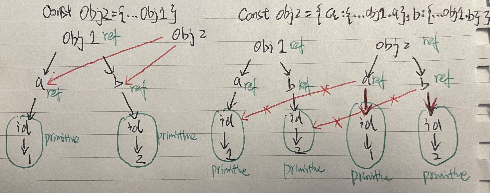

# InterviewPreparation

_This Repo aims to collect and organize potential interview questions._

## Question Types

- Algorithms
- Data Structures
- LeetCode Challenges
- Programming Language Basics

## Programming Languages

- JavaScript
- TypeScript
- Java

## General Notes

- **Copy**

  **Reference Copy**: create another variable that point to the same object: var1 --> obj1 0x86 <-- var2
  
