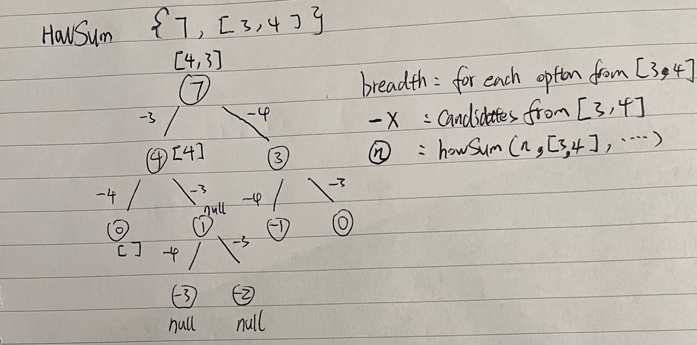

# Dynamic Programming

### Memoization

#### workflow

1. visualize problem as a tree
2. solve with recursive brutal force
3. optimize with memo

#### big O analysis

1. const time : 1 => input size 2 -> runtime does not change
2. log time: log(n) => input size 2 -> runtime <2
3. linear time: n => input size 2 -> runtime 2
4. quaslinear time: nlogn => input size 2 -> runtime <4
5. quadradic time: n^2 => input size 2 -> runtime 4
6. expo time: 2^n => input size 2 -> runtime 8

#### recusrsion big O analysis

- level of tree = l
- breadth of tree b

1. the space complexity is always l.
2. the time complexity is always b ^ l.
3. time complexiy can be reduced from exponential to linear or linear x linear by memoization.

#### Examples

- howSum(tartgetSum, numbers, memo):
  

- countConstruct(target, wordDict, memo):
  

- houseRob(nums):
  

- mergeSort(arr):

  

## Miscs

- **Copy**

  **Reference Copy**: create another variable that point to the same object: var1 --> obj1 0x86 <-- var2
  

- **Heaps**

  - Min Heap: parent node is always smaller than child nodes
  - Max Heap: parent node is always larger than child nodes
  - Array representation:
    - node: `i`
    - parent: `floor((i-1)/2)`
    - left child: `2i+1`
    - right child: `2i+2`

- **Dijkstra**
  - Theory: If A->B->C->D is the shortest path from A to D, then A->B is the shortest path from A to B, B->C is the shortest path from B to C, and C->D is the shortest path from C to D.
  - Todo:
    - Initialize each node with distance = infinity except the source node = 0, and with previous = null
    - Nodes are in explored if all their neighbors are visited
    - Nodes are in toExplore if they are visited, they have an estimated distance and previous node
    - Nodes are in neither if they are not visited, they have infinity distance and null previous node
    - For each toExplore node; find the one with min distance; update its neighbors' distance and mark the nieghbor as unsettled; mark it as settled; repeat until all nodes are settled
