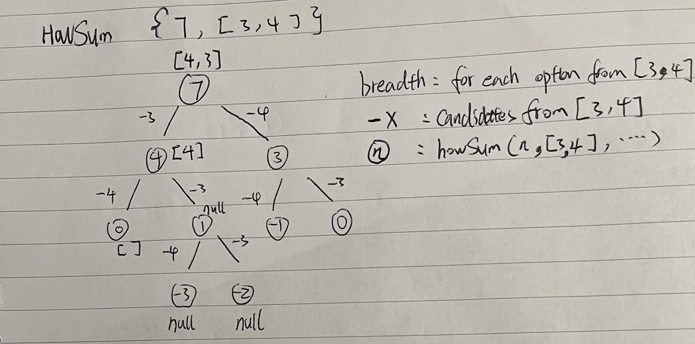

# Dynamic Programming

## Memoization

### workflow

1. visualize problem as a tree
2. solve with recursive brutal force
3. optimize with memo

### big O analysis

- level of tree = l
- breadth of tree b

1. the space complexity is always l.
2. the time complexity is always b ^ l.
3. time complexiy can be reduced from exponential to linear or linear x linear by memoization.

### Examples

- howSum(tartgetSum, numbers, memo):
  
