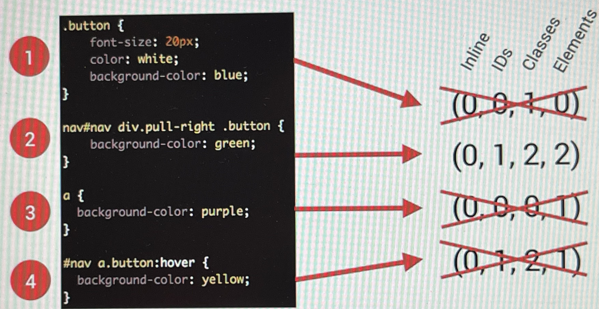
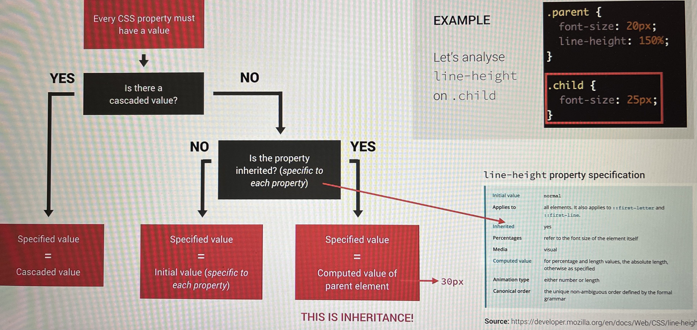

# CSS

## Syntax

selector `.class` => 1 element can have multiple classes

selector `#id` => 1 element can have only 1 id

selector `*` => all elements

`element`

`element, element` => want both elements to have the same property

`element1 element2` => all element2 inside element1 gain the property

`element1 > element2` => all element2 with the parent to be element1

`element1 + element2` => the element2 parallelly after element1

pseudo class `:hover`

pseudo class`:last-child`

pseudo class`:first-child`

## Box Model

## Casecade (Importance >> Specificity >> Source Order)

Author: css programmers write

User: css edited on browser dev tool

- Importance: User !important > **Author `!important` > Author** > User
- Specificity: inline >> id > class | pseudo class >> element | pseudo element.
  
- Source Order: order of css code

Summary:

- css classs declared with `!important` has highest priority
- inline styles always has priority over styles in `.css` files
- id is more specific than class e.g.`#btn{} >> .btn{}`
- class is more specific than element e.g.`.btn{} >> btn{}`
- Rely on specificity rather than order of selectors
- Pseudo classes should have higher specificity than original classes to make the effect occur e.g. `xxx:hover{} >> xxx{}` then we see the effect of hover

## Inheritance

Workflow:

Summary:

- Inheritance passes the values for some specific properties from parent to child
- Properties related to text ofent inherited: font-family font-size, color ...

## Grid Properties

### container

1. grid-template:

   - grid-template-rows
   - grid-template-columns
   - grid-template-areas

2. grid-gap

   - grid-row-gap
   - grid-column-gap

3. item positions

   - justify-items
   - align-items
   - justify-content
   - align-content

4. auto
   - grid-auto-row
   - grid-auto-columns
   - grid-auto-flow

### item

1. item positions

   - justify-self
   - align-self

2. order

3. grid-area

   - grid-row

     - grid-row-start
     - grid-row-end

   - grid-column
     - grid-column-start
     - grid-column-end
